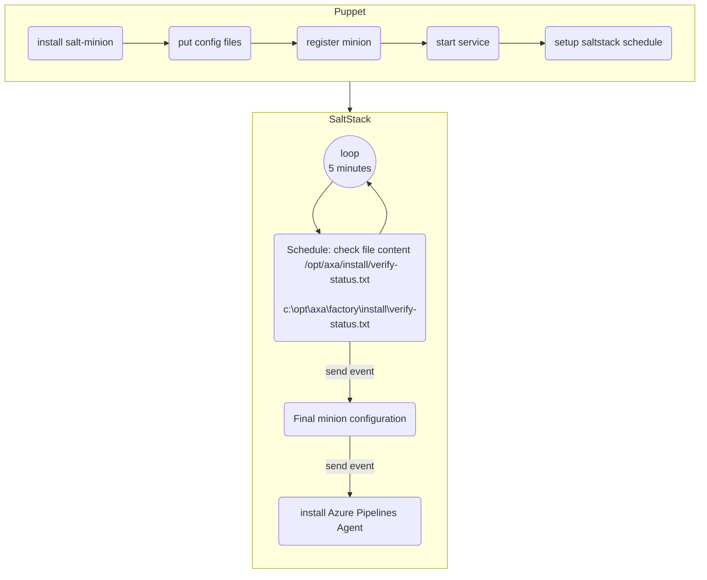

# mermaid-test

```mermaid
  flowchart TD;
    subgraph puppet [Puppet]
    direction LR
      P1(install salt-minion);
      P2(put config files);
      P3(register minion);
      P4(start service) ;
      P5(setup saltstack schedule) ;
      P1 --> P2 --> P3 --> P4 --> P5
    end
    subgraph saltstack [SaltStack]
      direction TB
      S1((loop\n 5 minutes))
      S2(Schedule: check file content \n /opt/axa/install/verify-status.txt\n c:\opt\axa\factory\install\verify-status.txt)
      S3(Final minion configuration)
      S4(install Azure Pipelines Agent)
      S2 --> S1 --> S2
      S2 -->|send event| S3 -->|send event| S4
    end
    
    puppet --> saltstack
      
```